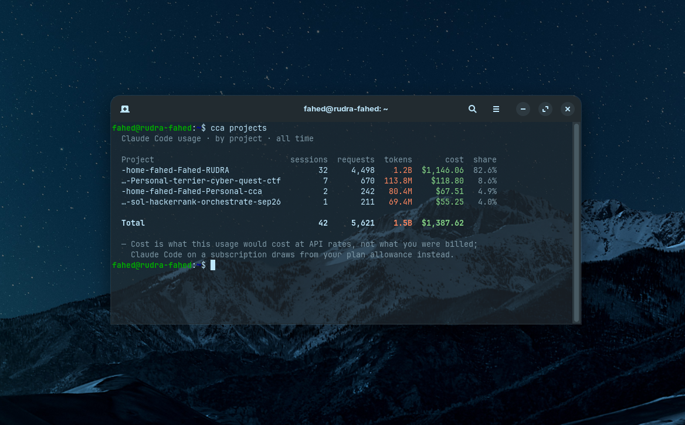
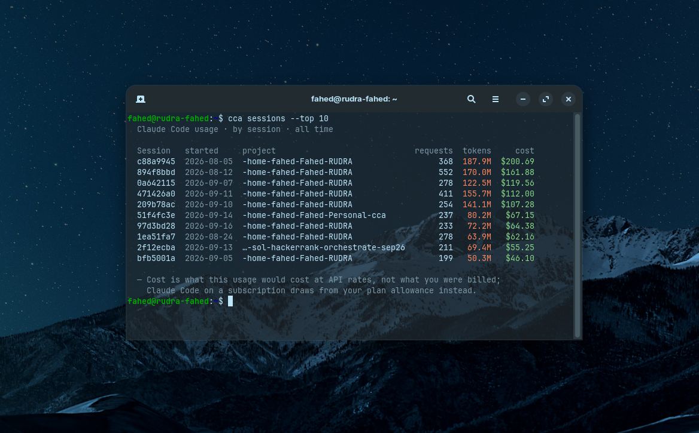

Four views slice the same data different ways. Each accepts the same
[time range flags](/cca/guides/time-ranges/) and
[output formats](/cca/guides/machine-output/).

## By model

```sh
cca models
```

```
  Claude Code usage · by model · all time

  Model                      requests  tokens    cost  share
  claude-opus-5                   101   20.3M  $37.87  62.3%
  claude-sonnet-5                 111   20.3M  $15.97  26.3%
  claude-haiku-4-5-20251001       128   19.4M   $6.99  11.5%

  Total                           340   60.0M  $60.82

  ─ Cost is what this usage would cost at API rates, not what you were billed;
    Claude Code on a subscription draws from your plan allowance instead.
```

`share` is the percentage of the **cost** total, not of tokens — the two can
differ sharply, because a million Haiku tokens and a million Opus tokens cost
very different amounts.

## By project

```sh
cca projects
```



```
  Claude Code usage · by project · all time

  Project                  sessions  requests  tokens    cost  share
  -home-dev-payments-api          4        95   17.6M  $25.51  41.9%
  -home-dev-infra-scripts         4       117   20.2M  $20.88  34.3%
  -home-dev-web-dashboard         5       128   22.1M  $14.43  23.7%

  Total                          13       340   60.0M  $60.82

  ─ Cost is what this usage would cost at API rates, not what you were billed;
    Claude Code on a subscription draws from your plan allowance instead.
```

Project names are the slugified working directories Claude Code stores
transcripts under. Long ones are shortened **from the left**, because the tail
is what distinguishes them:

```
…-Personal-terrier-cyber-quest-ctf
```

The `sessions` column counts distinct conversations in that directory.

## By day

```sh
cca daily
```

```
  Claude Code usage · by day · all time

  Date        requests  tokens    cost
  2026-09-05        22    2.9M   $1.65
  2026-09-06        17    3.2M   $4.33
  2026-09-07        41    6.7M   $6.05
  2026-09-08        47   10.0M   $8.98
  2026-09-12        23    3.5M   $2.38
  2026-09-13         3  614.3K   $0.54
  2026-09-14        19    2.6M   $2.89
  2026-09-15        57    9.9M  $15.02
  2026-09-16        34    6.7M   $4.64
  2026-09-18        68   11.9M  $13.11
  2026-09-19         9    2.0M   $1.22

  Total            340   60.0M  $60.82

  ─ Cost is what this usage would cost at API rates, not what you were billed;
    Claude Code on a subscription draws from your plan allowance instead.
```

Rows are ordered oldest first, so the most recent day sits nearest your prompt.
Days with no usage are omitted rather than shown as zero.

:::note[Days are local, timestamps are UTC]
Claude Code records timestamps in UTC; `cca` buckets them into **your local
calendar days**. A turn at 23:30 UTC belongs to the next day if you are east of
Greenwich. This is deliberate — you think in local days.
:::

## By session

```sh
cca sessions --top 10
```



```
  Claude Code usage · by session · all time

  Session   started     project                  requests  tokens    cost
  070d7109  2026-09-15  -home-dev-payments-api         38    7.1M  $11.09
  7a3a8394  2026-09-08  -home-dev-infra-scripts        35    7.6M   $7.46
  b82763ba  2026-09-07  -home-dev-infra-scripts        41    6.7M   $6.05
  bee80626  2026-09-18  -home-dev-payments-api         26    4.9M   $6.03
  a3a16d92  2026-09-16  -home-dev-web-dashboard        34    6.7M   $4.64

  ─ Cost is what this usage would cost at API rates, not what you were billed;
    Claude Code on a subscription draws from your plan allowance instead.
```

Each session is shown with its title, so the table says what the work was
rather than only which UUID it had. A session with no recorded name gets a
dash. See [Session titles](/cca/guides/session-titles/).

Session identifiers are shortened to their first segment for the table. The
**full** identifier is available in `--json` and `--csv`, which is where you
would use it to find the transcript file.

`--top N` limits the rows; it defaults to 10 and does not change any total.

The `water` column is that session's share of the estimate. Because water is a
flat rate per token, it is the token column in different units — it gives a
sense of scale, not a separate signal. `--no-water` hides it and brings back
the column it displaces (`started` with titles on, `requests` without). See
[The water estimate](/cca/internals/water/).
