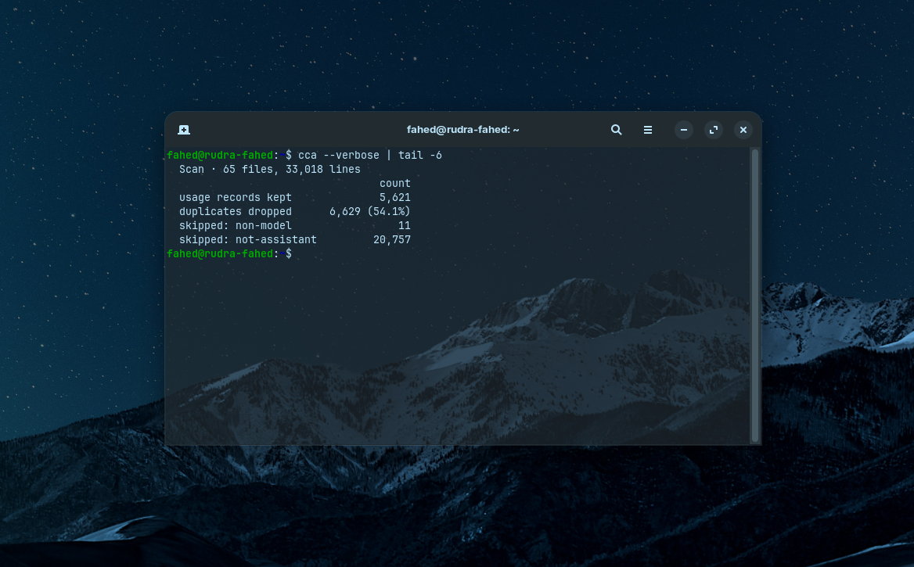

## Start with `--verbose`

```sh
cca --verbose
```



```
  Claude Code usage · all time · 13 sessions across 3 projects

  Tokens   input  output  cache 5m  cache 1h  cache read
          144.5K  673.5K    503.0K      6.6M       52.0M

  Model                      tokens    cost
  claude-opus-5               20.3M  $37.87
  claude-sonnet-5             20.3M  $15.97
  claude-haiku-4-5-20251001   19.4M   $6.99

  Cost    $60.82     at API list prices
  Water   ≈ 18.0 L   about 2 minutes of shower

  ─ Cost is what this usage would cost at API rates, not what you were billed;
    Claude Code on a subscription draws from your plan allowance instead.
  ─ Water assumes 0.30 mL / 1k tokens, a rough estimate. See README.

  Scan · 18 files, 450 lines
                            count
  usage records kept          340
  duplicates dropped  110 (24.4%)
```

This block makes the headline numbers auditable: what was scanned, what was
kept, and what was dropped and why.

The **duplicates** figure is the one to look at first. The same assistant
message is replayed into several files by resumed sessions and compaction, so a
ratio around half is normal and healthy. A ratio of zero would suggest
deduplication is not working.

## Common messages

### `claude directory not found`

```
cca: claude directory not found: /home/you/.claude/projects
If Claude Code stores its data elsewhere, point cca at it with --claude-dir
```

Nothing exists at that path. Either Claude Code has never run, or its data is
elsewhere:

```sh
cca --claude-dir /path/to/.claude
```

### `exists but holds no transcripts yet`

The directory is there but empty. Normal for a fresh install — run Claude Code
once and try again.

### `No usage found`

The directory parsed fine and contained no usage-bearing records. If you passed
a time range, try widening it; `--verbose` reports how many records the window
excluded.

### `N models had no rate`

```
─ 1 model had no rate and was excluded from the cost total: claude-future-9.
  Add it to pricing.json to price it; see README.
```

`cca` will never guess a rate. The tokens still count; only the dollars are
missing. Add the model to a [pricing override](/cca/reference/pricing/).

### `--json and --csv are mutually exclusive`

Each describes one output shape. Pick one.

### `this command already sets its own time range`

`cca today --since 7d` asks for two different windows. Use `cca --since 7d`.

## Numbers look too high

Almost always deduplication. Check `--verbose`: if `duplicates dropped` is
zero on a corpus with resumed sessions, something is wrong — please
[open an issue](https://github.com/12fahed/cca/issues).

## Numbers look too low

Three common causes:

1. **A time range is active.** Check the header line.
2. **`--no-sidechains` is set**, in a flag or in your config file. Check
   `cca config`.
3. **The transcript is incomplete.** Claude Code prunes history, and does not
   guarantee that every billed turn was recorded. See
   [Accuracy and limits](/cca/internals/accuracy/).

## Totals changed between runs

Expected. Claude Code prunes and rotates transcripts, so historical figures can
**fall** over time. `cca` reports what is on disk now; it is not an
append-only ledger.

## Output looks garbled

Your terminal is mangling the box-drawing characters:

```sh
cca --ascii
```

For escape sequences appearing literally, disable styling:

```sh
cca --no-color
# or
NO_COLOR=1 cca
```

## Colour is missing when piping

By design — `cca` disables styling when output is not a terminal. To keep it
while paging:

```sh
CLICOLOR_FORCE=1 cca | less -R
```
