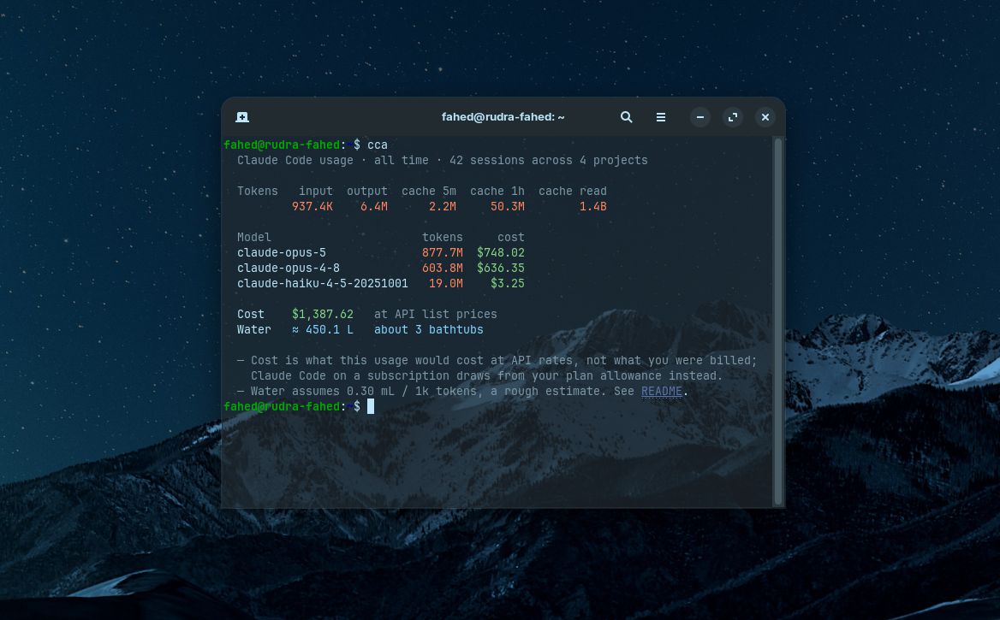

import { Card, CardGrid, LinkCard } from '@astrojs/starlight/components';

<CardGrid>
  <Card title="Runs entirely offline" icon="laptop">
    Reads `~/.claude` and nothing else. No network calls at any point, no
    telemetry, and it never writes to your transcripts.
  </Card>
  <Card title="Honest about itself" icon="approve-check">
    The dollar figure is what your usage *would* have cost at API rates — not a
    bill. Every caveat is printed alongside the number, not buried in a footnote.
  </Card>
  <Card title="Single static binary" icon="rocket">
    No runtime dependencies, no interpreter. Build it with `make build` and copy
    it wherever you like.
  </Card>
  <Card title="Scriptable" icon="seti:json">
    `--json` and `--csv` on every view, with exact token counts and full session
    identifiers.
  </Card>
</CardGrid>

## What it looks like

<CardGrid>
  <LinkCard title="Installation" href="/cca/start/installation/" description="Build from source or download a binary." />
  <LinkCard title="Quick start" href="/cca/start/quick-start/" description="Your first five commands." />
  <LinkCard title="Command reference" href="/cca/reference/commands/" description="Every command and what it prints." />
  <LinkCard title="How cost is calculated" href="/cca/internals/cost/" description="Deduplication, cache tiers, and the rate table." />
</CardGrid>
